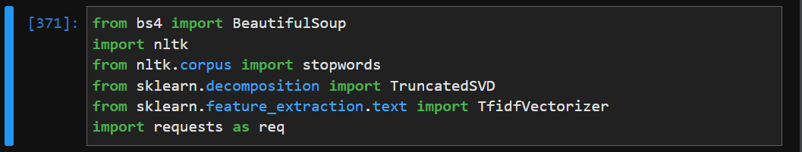
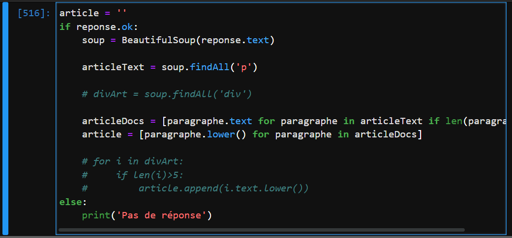
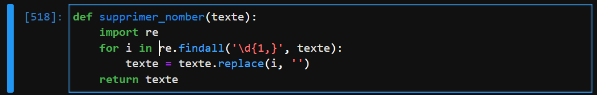
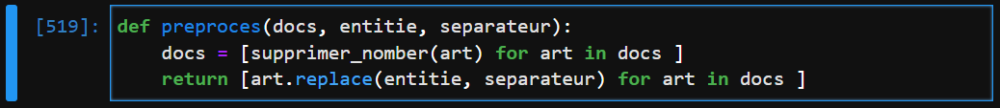
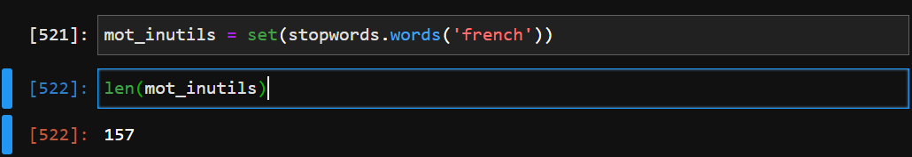
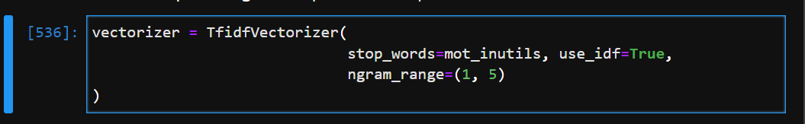
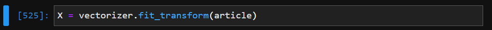
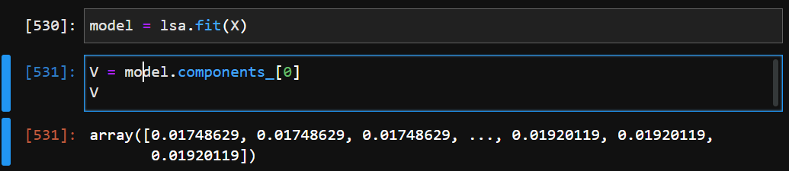
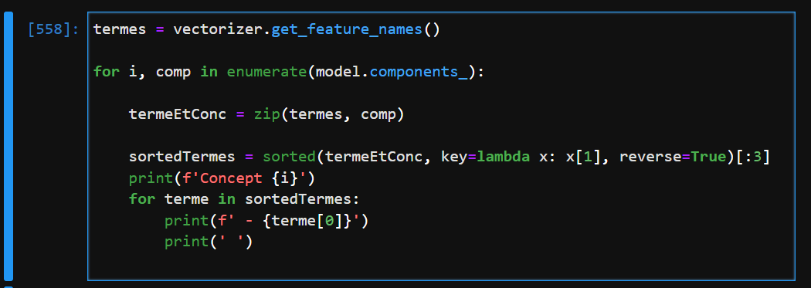

# Analyse Semantique Latente

Cet article passe en revue l'analyse sémantique latente (LSA), une théorie de la signification ainsi qu'une méthode pour extraire ce sens de passages de texte, basée sur des statistiques calculs sur un ensemble de documents. LSA comme théorie du sens définit un espace sémantique latent où les documents et les mots individuels sont représentés sous forme de vecteurs. LSA en tant que technique de calcul utilise l'algèbre linéaire pour extraire les dimensions qui représentent cet espace. Cette représentation permet le calcul de la similarité entre les termes et les documents, la catégorisation des termes et documents, et résumé de grandes collections de documents en utilisant procédures automatisées qui imitent la façon dont les humains effectuent des tâches cognitives similaires. Nous présentons quelques détails techniques, divers exemples illustratifs et discutons d'un nombre de candidatures en linguistique, psychologie, sciences cognitives, éducation, sciences de l'information et analyse de données textuelles en général. 

## Objectif de Notre Analyse

Dans ce projet, nous allons voir comment « extraire » des concepts à partir d'un corpus (collection) de documents textuels.

Je vais vous montrer comment extraire mathématiquement des "concepts" de ce corpus. La technique que nous allons utiliser s'appelle "l'analyse sémantique latente".

## Les Packages Utilisés

* **BeautifulSoup**: Je vais utiliser ce package pour le webscraping c'est à dire l'extraction des information à travers l'internet.
  
* **nltk**: ce package pour les manipulations l'inguistique et nettoyage des textes à analyser.
  
* **TruncatedSVD**: pour la reduction de la dimensionnalité des matrices creuses.
  
* **TfidfVectorizer**: pour  le calcule ses fréquence des mots et termes dans les documents

## Web Scraping

dans ce tutoriel je vais scrapé cet article sur le Deep Learning à travers le **site CNRS** Le Journal.
[https://lejournal.cnrs.fr/billets/letonnante-acceptabilite-des-deep-fake](https://lejournal.cnrs.fr/billets/letonnante-acceptabilite-des-deep-fake)

## Le Code du Web Scraping En Python

## Quelques Data Préprocessing

### Suppression des Nombres

### Suppression des Entités

## Les Stopwords

Les **Les Stopwords** sont des mots que je ne veux pas convertir en **features** ou variables, car ils ne sont pas particulièrement utiles. Des mots comme **a**, **et** et **le** sont de bons **Stopwords** en français. Je peux utiliser une liste intégrée de **Stopwords** de **nltk** pour commencer. 

### Création des Stopwords

## TF-IDF Vectorizing

Je vais utiliser le vectoriseur TF-IDF de scikit-learn pour prendre mon corpus et convertir chaque document en une matrice creuse de fonctionnalités TFIDF...

* Le parmètre **stop_words**, permet de supprimer les **stopwords**
* Le paramètre **ngram_range** permet de decomposer les termes en  **n_min:1** et **n_max**
  dans notre cas ici.

## Entrainement de Notre Modèle TF-IDF Vectorizing

## LSA ( TruncatedSVD )

* **Entrée : X**, une matrice où m est le nombre de documents que j'ai, et n est le nombre de termes

* **Processus :** Je vais décomposer X en matrices appelées U, S et T. Lorsque nous effectuons la décomposition, nous devons choisir une valeur k, c'est le nombre de concepts que nous allons conserver.

<pre>

                    X = USVT

</pre>

* **U :** sera une matrice mxk. Les lignes seront des documents et les colonnes seront des **concepts**
* **S :** sera une matrice kxk. Les éléments seront la quantité de variation capturée à partir de chaque **concept**
* **V :** sera une matrice mxk (attention à la transposition). la ligne sera les termes et les colonnes seront **concepts**

## Création et Entrainement du Modèle TruncatedSVD

## Extraction des Termes et Concepts dans l'Articles

## Vidéo

[https://www.youtube.com/watch?v=fnU9moB-_DI](https://www.youtube.com/watch?v=fnU9moB-_DI)

## Liens Utils
1.  [Latent semantic analysis](https://wires.onlinelibrary.wiley.com/doi/pdf/10.1002/wcs.1254?casa_token=9ZNnFxW7j4wAAAAA%3AXQ1KAKPHx0v4YlLYHe5LW4OXhee6s-B2CfAOzb68JIjFob3zKlQUs8aVhQlaYXhNdnGK0TGEbW4X2qp_sg) 
2.  [Comprende le package requests](https://www.datacamp.com/community/tutorials/making-http-requests-in-python?utm_source=adwords_ppc&utm_medium=cpc&utm_campaignid=1455363063&utm_adgroupid=65083631748&utm_device=c&utm_keyword=&utm_matchtype=&utm_network=g&utm_adpostion=&utm_creative=278443377086&utm_targetid=aud-299261629574:dsa-429603003980&utm_loc_interest_ms=&utm_loc_physical_ms=9075935&gclid=CjwKCAiAx8KQBhAGEiwAD3EiP7eGDVW4hMxOzOO8TQZ_XNyF9rPVbRiU0U6qjnZZ-piDzFH9kgz4dRoCqcYQAvD_BwE)
3.  [https://www.crummy.com/software/BeautifulSoup/bs4/doc/](https://www.crummy.com/software/BeautifulSoup/bs4/doc/)
4. [https://pythonspot.com/nltk-stop-words/](https://pythonspot.com/nltk-stop-words/) 
5. [https://scikit-learn.org/stable/modules/generated/sklearn.feature_extraction.text.TfidfVectorizer.html](https://scikit-learn.org/stable/modules/generated/sklearn.feature_extraction.text.TfidfVectorizer.html)
6. [https://scikit-learn.org/stable/modules/generated/sklearn.decomposition.TruncatedSVD.ht](https://scikit-learn.org/stable/modules/generated/sklearn.decomposition.TruncatedSVD.ht)
   

